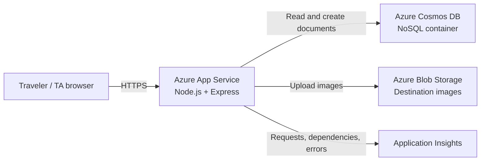

# Atlas Travel Catalogue - Architecture Document

## Public URL

Replace this placeholder after deployment:

`https://YOUR-APP-NAME.azurewebsites.net`

## Architecture decisions

The application uses a Node.js Express backend because it is small, easy to deploy to Azure App Service, and keeps the API and browser application in one repository. The frontend is plain HTML, CSS, and JavaScript so the submission has a small build surface and is easy to demonstrate.

Travel destinations are stored as JSON documents in Azure Cosmos DB for NoSQL. Documents use `continent` as the partition key, which supports the catalogue's main grouping while keeping the data model flexible. The local JSON fallback allows development without cloud credentials, but the deployed application uses Cosmos DB through environment variables.

Azure App Service provides the public HTTPS endpoint and manages the Node.js process. Secrets are stored as App Service application settings rather than in source control.

## Architecture diagram

## Cloud features and value

### 1. Azure Blob Storage

The add-destination form accepts a JPG, PNG, or WEBP image up to 5 MB. The server uploads the file to a Blob Storage container and saves the resulting URL with the destination document. Blob Storage is a better fit than a database for image bytes because it is designed for object storage, scales independently, and keeps Cosmos DB documents small.

### 2. Application Insights

Application Insights automatically tracks HTTP requests, dependencies, and server exceptions. This is useful for a public catalogue because the developer can confirm that the public URL is healthy, inspect slow requests, and diagnose failures without adding visible complexity to the application.

## Requirement mapping

| Requirement | Implementation |
|---|---|
| Data layer | Azure Cosmos DB for NoSQL |
| Add entries | `POST /api/destinations` and the Add destination form |
| List entries | `GET /api/destinations` |
| Filter attributes | Search, continent, mood, and maximum daily budget |
| Invalid inputs | Server-side validation plus friendly form errors |
| Public URL | Azure App Service HTTPS URL |
| Two cloud features | Azure Blob Storage and Application Insights |

## Cost controls

Use student credits/free quotas where available. Configure the smallest practical App Service and Cosmos DB throughput, delete unused resources, and stop or remove the App Service after grading if the course allows it. Do not upload credentials to GitHub.
